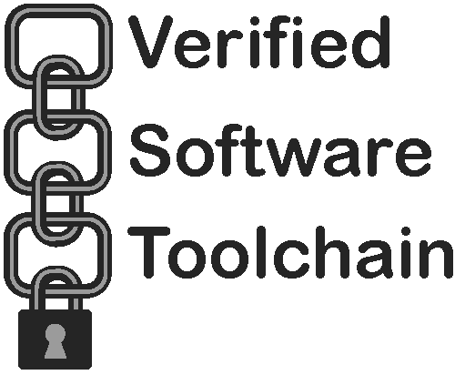

with contributions from

[Andrew W. Appel](http://www.cs.princeton.edu/~appel/),
[Lennart Beringer](http://www.cs.princeton.edu/~eberinge/),
[Robert Dockins](http://rwd.rdockins.name/),
[Josiah Dodds](http://www.cs.princeton.edu/~jdodds/),
[Aquinas Hobor](http://www.comp.nus.edu.sg/~hobor/),
[Jean-Marie Madiot](https://madiot.fr/),
[Gordon Stewart](http://www.cs.princeton.edu/~jsseven/),
[Qinxiang Cao](http://jhc.sjtu.edu.cn/people/members/faculty/qinxiang-cao.html),
Qinshi Wang,
and others.

The [LICENSE](LICENSE) file has information about copyright, licensing, and permissions.

## How to install:

The current release is generally available on opam via the Coq Platform;
[see here](https://vst.cs.princeton.edu/download) for instructions.

To download (or clone) from github and install from sources, see 
[BUILD_ORGANIZATION](BUILD_ORGANIZATION.md) instructions.

## Documentation:

[Our webpage](https://vst.cs.princeton.edu) describes the goals of the project
and has links to many related publications.

For an introduction to how to use Verifiable C,
[read the manual](doc/VC.pdf),
or consult [Software Foundations Volume 5: Verifiable C](https://softwarefoundations.cis.upenn.edu/vc-current/index.html)
for a tutorial with exercises.

[Program Logics for Certified Compilers](https://www.cs.princeton.edu/~appel/papers/plcc.pdf), by Andrew W. Appel et al.,
Cambridge University Press, 2014.
Available in [hardcover](http://www.barnesandnoble.com/w/program-logics-for-certified-compilers-andrew-w-appel/1117300694).

